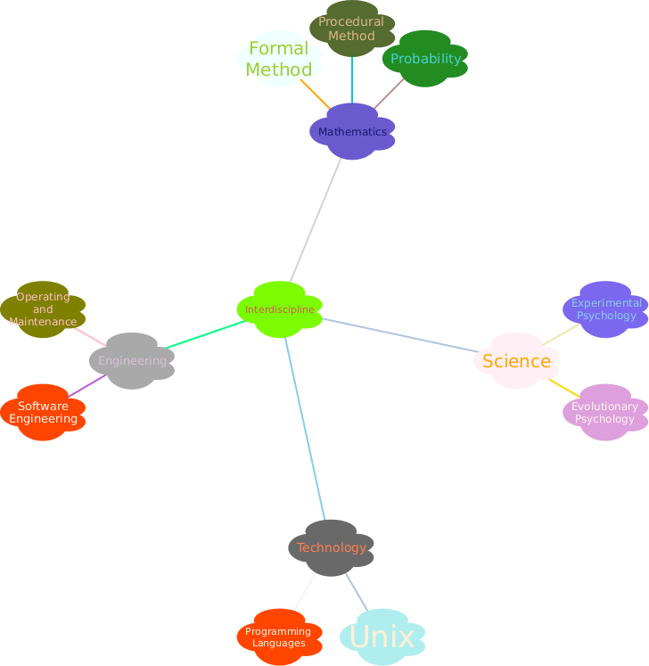

# Digital-World

How to build a digital world? Okay, we don't start with the _File Island_, but we own some concepts from the _Digimon_.

## Subprojects

**Note** Project or Subprojects are organized as the `digimon`s within [**village**](village).

**Note** Each project may be separated into several repositories within [**island**](island), [**tamer**](tamer), respectively. 

+ [**Sakuyamon**](village/sakuyamon) is in charge of this **Digital World**.

## Project Conventions

+ [**dot book**](.book) is a mystery that sets up all the prerequistes of the world. Sounds like `local`.
+ [**d-ark**](d-ark) is the interface for users to talk with `digimon`s. Namely it works like `bin`
+ [**village**](village) is the birth place of `digimon`s. Namely it works like `src`.
+ [**digitama**](digitama) is the egg of `digimon`s. Namely it works like `libraries` or `frameworks`.
+ [**island**](island) is the living environment of _Children_ `digimon`s. Namely it works like `share` or `collection`.
  - _nature_ defines your `digimon`'s look and feel.
+ [**tamer**](tamer) is the interface for developers to train the _Baby_ `digimon`. Namely it works like `test`.

